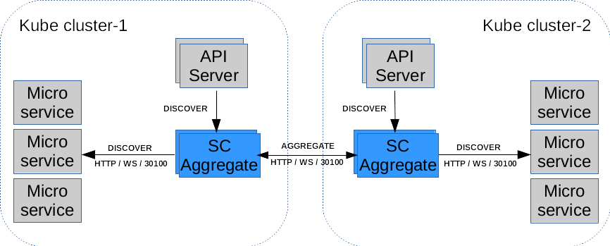

Access Distinct Clusters
========================

ServiceCenter Aggregate Architecture
------------------------------------

In the `Multiple Datacenters`_ article, we introduce the aggregation
architecture of service center. In fact, this aggregation architecture
of service center can be applied not only to the scene deployed in
multiple datacenters, but also to the scene services data aggregation in
multiple kubernetes clusters.

   architecture

The service centers deployed in distinct kubernetes clusters can
communicate with each other, sync the services data from other
kubernetes clusters. Applications can discover services from different
the kubernetes cluster through using the service center HTTP API. **It
solve the problem of isolation between kubernetes clusters**.

Quick Start
-----------

Let’s assume you want to install 2 clusters of Service-Center in
different Kubernetes clusters with following details.

======= ========== ========= =========
Cluster Kubernetes namespace Node
======= ========== ========= =========
sc1     k1         default   10.12.0.1
sc2     k2         default   10.12.0.2
======= ========== ========= =========

To facilitate deployment, we will publish the service address of the
service center in [``NodePort``] mode.

Deploy the Service Center
'''''''''''''''''''''''''

Using helm to deploy the service center to kubernetes here, the
instructions for specific ``values`` can be referred to `here`_.

Take deployment to kubernetes cluster 1 as an example.

.. code:: bash

   # login the k1 kubernetes master node to deploy sc1
   git clone git@github.com:apache/servicecomb-service-center.git
   cd examples/infrastructures/k8s
   helm install --name k1 \
       --set sc.discovery.clusters="sc2=http://10.12.0.2:30100" \
       --set sc.discovery.aggregate="k8s\,servicecenter" \
       --set sc.registry.type="buildin" \
       --set sc.service.type=NodePort \
       service-center/

Notes: To deploy Service Center in kuberbetes cluster 2, you can repeat
the above steps and just change the ``sc.discovery.clusters`` value to
``sc1=http://10.12.0.1:30100``.

Start Server
''''''''''''

Edit the configuration of the ip/port on which Server will register.

::

   vi examples/discovery/server/conf/chassis.yaml

Replace the below values

.. code:: yaml

   cse:
     service:
       registry:
         type: servicecenter
         address: http://10.12.0.2:30100 # the address of SC in dc-2

Run the Server

.. code:: bash

   go run examples/discovery/server/main.go

Start Client
''''''''''''

Edit the configuration of the ip/port on which Client will register and
discover.

.. code:: bash

   vi examples/discovery/client/conf/chassis.yaml

Replace the below values

.. code:: yaml

   cse:
     service:
       registry:
         registrator:
           type: servicecenter
           address: http://10.12.0.1:30100 # the address of SC in dc-1
         serviceDiscovery:
           type: servicecenter
           address: http://10.12.0.3:30100 # the address of SC Aggregate

Run the Client

.. code:: bash

   go run examples/discovery/client/main.go

Confirm the multiple datacenters discovery is OK
''''''''''''''''''''''''''''''''''''''''''''''''

Since client is not a service, we check its running log.

::

   2018-09-29 10:30:25.556 +08:00 INFO registry/bootstrap.go:69 Register [Client] success
   ...
   2018-09-29 10:30:25.566 +08:00 WARN servicecenter/servicecenter.go:324 55c783c5c38e11e8951f0a58ac00011d Get instances from remote, key: default Server
   2018-09-29 10:30:25.566 +08:00 INFO client/client_manager.go:86 Create client for highway:Server:127.0.0.1:8082
   ...
   2018/09/29 10:30:25 AddEmploy ------------------------------ employList:<name:"One" phone:"15989351111" >

.. _Multiple Datacenters: multidcs.rst
.. _here: https://github.com/apache/servicecomb-service-center/tree/master/scctl/examples/infrastructures/k8s