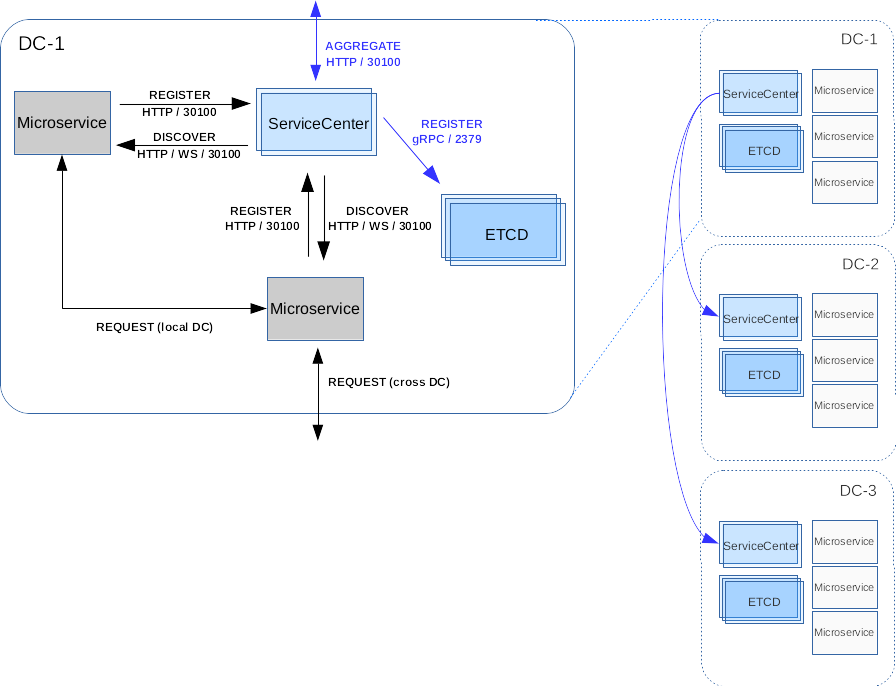

Using Java chassis for cross data center access
===============================================

Now that you’ve seen two `multiple data center`_ architectures of the
Service Center, we’ll show you how to implement micro-service cross data
center access with the `java-chassis`_ framework.

   architecture

Quick Start
-----------

Let’s assume you want to install 2 clusters of Service-Center in
different DCs with following details.

======= ========== =========
Cluster Datacenter Address
======= ========== =========
sc-1    dc-1       10.12.0.1
sc-2    dc-2       10.12.0.2
======= ========== =========

Start Service-Center
''''''''''''''''''''

Edit the configuration of the ip/port on which SC will run in dc-1. And
here we assume your etcd is running on http://127.0.0.1:2379 (you can
follow `this`_ guide to install etcd in cluster mode.)

.. code:: bash

   vi conf/app.conf
   # Replace the below values
   httpaddr = 10.12.0.1
   discovery_plugin = aggregate
   aggregate_mode = "etcd,servicecenter"
   manager_name = "sc-1"
   manager_addr = "http://127.0.0.1:2379"
   manager_cluster = "sc-1=http://10.12.0.1:30100,sc-2=http://10.12.0.2:30100"

   # Start the Service-center
   ./service-center

Notes: + ``manager_name`` is the alias of the data center.
``manager_addr`` is the etcd cluster client urls. ``manager_cluster`` is
the full Service Center clusters list. + To deploy Service Center in
dc-2, you can repeat the above steps and just change the ``httpaddr``
value to ``10.12.0.2``.

Confirm the service is OK
'''''''''''''''''''''''''

We recommend that you use `scctl`_, and using `cluster command`_
which makes it very convenient to verify OK.

.. code:: bash

   scctl --addr http://10.12.0.3:30100 get cluster
   #   CLUSTER |        ENDPOINTS
   # +---------+-------------------------+
   #   sc-1    | http://10.12.0.1:30100
   #   sc-2    | http://10.12.0.2:30100

Example
-------

Here we show a ``java`` example of multiple datacenters access, where we
use an `example`_, assuming that below.

============ ========== =========
Microservice Datacenter Address
============ ========== =========
Client       dc-1       10.12.0.4
Server       dc-2       10.12.0.5
============ ========== =========

Start springmvc-server
''''''''''''''''''''''

Edit the configuration of the ip/port on which ``springmvc-server`` will
register.

::

   vi src/main/resources/microservice.yaml

Replace the below values

.. code:: yaml

   cse:
     service:
       registry:
         address: http://10.12.0.2:30100 # the address of SC in dc-2

Run the Server

.. code:: bash

   mvn clean install
   java -jar target/springmvc-server-0.0.1-SNAPSHOT.jar

Start springmvc-client
''''''''''''''''''''''

Edit the configuration of the ip/port on which ``springmvc-client`` will
register.

.. code:: bash

   vi src/main/resources/microservice.yaml

Replace the below values

.. code:: yaml

   cse:
     service:
       registry:
         address: http://10.12.0.1:30100 # the address of SC in dc-1

Run the Client

.. code:: bash

   mvn clean install
   java -jar target/springmvc-client-0.0.1-SNAPSHOT.jar

Confirm the multiple datacenters discovery is OK
''''''''''''''''''''''''''''''''''''''''''''''''

Since ``springmvc-client`` is not a service, we check its running log.

::

   ...
   [2018-10-19 23:04:42,800/CST][main][INFO]............. test finished ............ org.apache.servicecomb.demo.TestMgr.summary(TestMgr.java:83)

.. _multiple data center: multidcs.rst
.. _java-chassis: https://github.com/apache/servicecomb-java-chassis
.. _this: https://github.com/coreos/etcd/blob/master/Documentation/op-guide/container.md
.. _scctl: ../scctl/README.md
.. _cluster command: https://github.com/apache/servicecomb-service-center/tree/master/scctl/pkg/plugin/README.md#cluster-options
.. _example: https://github.com/apache/servicecomb-java-chassis/tree/master/demo/demo-springmvc