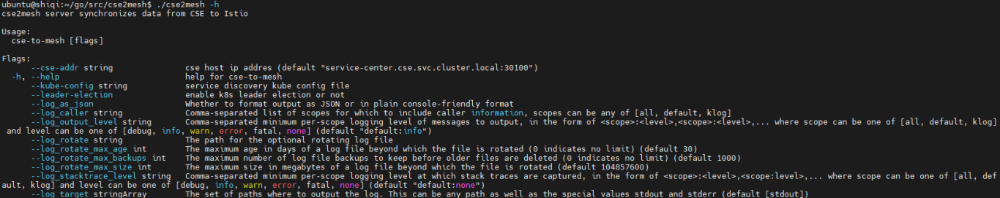

# User Guide
This instructions will lead you to getting start with using Servicecomb-service-center-istio

## 1. Install dependencies
This tool can be used both inside a k8s cluster and a standalone service running on a VM.

For both ways you have to install dependencies first.

### 1.1 Install Kubernetes Cluster
You can follow K8S [installation instruction](https://kubernetes.io/docs/setup/) to install a K8S cluster

### 1.2 Install Istio
Follow this [instruction](https://istio.io/latest/docs/setup/getting-started/) to install istio

**note: the instruction is just a show case of how to install and use istio, if you want to use it in production, you have to use a production ready installation profile**

### 1.3 Install Istio DNS
As any Servicecomb service center service will be translated to Serviceentry in K8S, while Kubernetes provides DNS resolution for Kubernetes Services out of the box, any custom ServiceEntrys will not be recognized. In addition to capturing application traffic, Istio can also capture DNS requests to improve the performance and usability of your mesh

Use the following command to install istio DNS:
```
cat <<EOF | istioctl install -y -f -
apiVersion: install.istio.io/v1alpha1
kind: IstioOperator
spec:
  meshConfig:
    defaultConfig:
      proxyMetadata:
        # Enable basic DNS proxying
        ISTIO_META_DNS_CAPTURE: "true"
        # Enable automatic address allocation, optional
        ISTIO_META_DNS_AUTO_ALLOCATE: "true"
EOF
```

### 1.4 Install Servicecomb service center
Servicecomb service center could be installed in K8S or on VM. 
Install Servicecomb service center follow this [instruction](https://github.com/apache/servicecomb-service-center/blob/master/README.md)

## 2 Install Servicecomb-service-center-istio
### 2.1 Building
You don’t need to build from source to use Servicecomb-service-center-istio (binaries in apache nexus ), but if you want to try out the latest and greatest, Servicecomb-service-center-istio can be easily built.
```
go build -o servicecomb-service-center-istio cmd/main.go
```

### 2.2 Building docker image
```
docker build -t servicecomb-service-center-istio:dev .
```

### 2.2 Run on VM
```
./servicecomb-service-center-istio --sc-addr=?SERVICE_CENTER_ADDRESS --kube-config=?KUBE_CONFIG_FILE_PATH
```

### 2.3 Run in K8S
```
# make sure you modified the input args in the deployment.yaml file first, specify you service center address
kubectl apply -f manifest/deployment.yaml
```

### 2.4 Input parameters


## 3 Example
We will use [consumer-provider](../../istio/examples/consumer-provider/) example to show how to use this tool.

We have two services: Provider and Consumer:
* `provider` is the provider of a service which calculates and returns the sum of the square root from 1 to a user provided parameter `x`.
* `consumer` performs as both provider and consumer. As a consumer, it calls the api provided by `provider` to get the result of the sum of square roots;
as a `provider`, it provides a service externally which returns the result it gets from `provider` to its clients.

While Provider uses servicecomb service center tech stack, Consumer uses istio tech stack. Origionaly, Provider and Consumer couldn't discover each other. 

In this demo, we are going to adopt our servicecomb-service-center-istio to brake the barrier between Provider and Consumer.

### 3.1 Build Provider and Consumer service images
#### 3.1.1 Consumer
```
> docker build --target consumer -t consumer:dev .
```

#### 3.1.2 Provider
Make sure you have already configed the registry related configuration (provider/conf/chassis.yaml)
```
> docker build --target provider -t provider:dev .
```

### 3.2 Deploy consumer and provider services
#### 3.2.1 Consumer
Because Consumer is Istio-based service, so it has to be run in the Kubernetes. We have our [deploument yaml](../../istio/examples/consumer-provider/manifest/consumer.yaml) file to deploy consumer into Kubernetes
```
> kubectl apply -f manifest/consumer.yaml
```
#### 3.2.2 Provider
Provider service could be deployed either on a `VM` or `Kubernetes` cluster.

For VM
```
# go to provider folder and run
> ./provider
```

For Kubernetes
```
> kubectl apply -f manifest/provider.yaml
```

### 3.3 Testing
Now you can try to request `consumer` service and you can get the response which is actually return from `provider` service.
```
> curl http://${consumerip}:${consuemrport}/sqrt?x=1000
Get result from microservice provider: Sum of square root from 1 to 1000 is 21065.833111
```