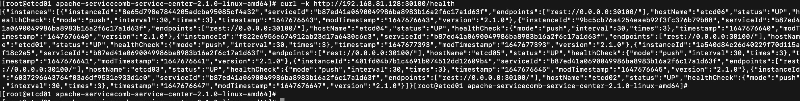

# syncer

Service-Center supports synchronization. If you want to use synchronization, you can refer to the step.

## preparation before installation

### download package

> Note: Only the 2.1+ version of sc supports synchronization
- [service-center](https://github.com/apache/servicecomb-service-center/releases)
- [etcd](https://github.com/etcd-io/etcd/releases)

### deployment Architecture

| vm-ip          | region   |
| -------------- |----------|
| 192.168.81.128 | region-1 |
| 192.168.81.129 | region-1 |
| 192.168.81.130 | region-1 |
| 192.168.81.131 | region-2 |
| 192.168.81.132 | region-2 |
| 192.168.81.133 | region-2 |

## installation operation

### install etcd

Refer to the official website [documentation](https://etcd.io/docs/v3.5/op-guide/clustering/).

### install sc
> Note: Only the 2.1+ version of sc supports synchronization 

**first step**: modify the files in `conf`

`app.conf`: modify frontend_host_ip and httpaddr to the local ip address

`app.yaml`: modify server.host, REGISTRY_KIND, REGISTRY_ETCD_CLUSTER_NAME, REGISTRY_ETCD_CLUSTER_MANAGER_ENDPOINTS, REGISTRY_ETCD_CLUSTER_ENDPOINTS

`chassis.yaml`: modify listenAddress to the local ip address

`syncer.yaml`: turn on the enableOnStart switch, and modify endpoints, the sc machine ip in region-2

**second step**: repeat the above operation to modify the configuration of sc on other machines

**third step**: start start-service-center.sh

sh `start-service-center.sh`

**the fourth step**: start start-frontend.sh

sh `start-frontend.sh`

open the front-end interface of any node

### verify health

curl -k http://{ip}:30100/health

> Congratulations！！！

