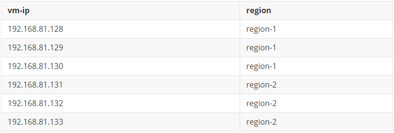
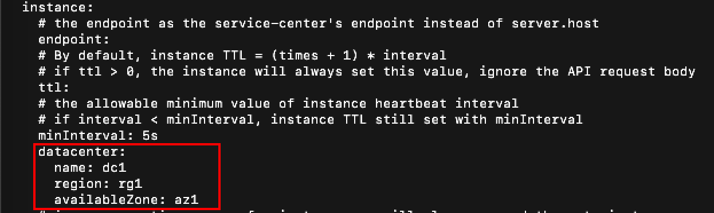

# Syncer

Service-Center supports synchronization. If you want to use synchronization, you can refer to the step.

## preparation before installation

### download package

> Note: Only the 2.1+ version of sc supports synchronization
- [service-center](https://github.com/apache/servicecomb-service-center/releases)
- [etcd](https://github.com/etcd-io/etcd/releases)

### deployment Architecture

As shown in the figure below, etcd can be deployed as an independent cluster.


It can also be deployed like this.




## installation operation

### install etcd

Refer to the official website [documentation](https://etcd.io/docs/v3.5/op-guide/clustering/).

### install sc
> Note: Only the 2.1+ version of sc supports synchronization 

#### step 1 
modify the files in `conf`

`app.conf`: modify frontend_host_ip and httpaddr to the local ip address


`app.yaml`: 

modify 

1. server.host
2. REGISTRY_KIND
3. REGISTRY_ETCD_CLUSTER_NAME
4. REGISTRY_ETCD_CLUSTER_MANAGER_ENDPOINTS
5. REGISTRY_ETCD_CLUSTER_ENDPOINTS
6. registry.instance.datacenter.name
7. registry.instance.datacenter.region
8. registry.instance.datacenter.availableZone




`chassis.yaml`: modify listenAddress to the local ip address


`syncer.yaml`: turn on the enableOnStart switch, and modify endpoints, the sc machine ip in region-2

#### step 2

Repeat the above operation to modify the configuration of sc on other machines.

#### step 3

```shell
sh start-service-center.sh
```

#### step 4

```shell
sh start-frontend.sh
```

#### step 5
Open the front-end interface of any node.


Instances in the peer region have been synchronized.


### verify health

```shell
curl -k http://{ip}:30100/health
```

```yaml
{
    "instances": [
        {
            "instanceId": "e810f2f3baf711ec9486fa163e176e7b",
            "serviceId": "7062417bf9ebd4c646bb23059003cea42180894a",
            "endpoints": [
                "rest://[::]:30100/"
            ],
            "hostName": "etcd03",
            "status": "UP",
            "healthCheck": {
                "mode": "push",
                "interval": 30,
                "times": 3
            },
            "timestamp": "1649833445",
            "dataCenterInfo": {
                "name": "dz1",
                "region": "rg1",
                "availableZone": "az1"
            },
            "modTimestamp": "1649833445",
            "version": "2.1.0"
        },
        {
            "instanceId": "e810f2f3baf711ec9486fa163e176e8b",
            "serviceId": "7062417bf9ebd4c646bb23059003cea42180896a",
            "endpoints": [
                "rest://[::]:30100/"
            ],
            "hostName": "etcd04",
            "status": "UP",
            "healthCheck": {
                "mode": "push",
                "interval": 30,
                "times": 3
            },
            "timestamp": "1649833445",
            "dataCenterInfo": {
                "name": "dz2",
                "region": "rg2",
                "availableZone": "az2"
            },
            "modTimestamp": "1649833445",
            "version": "2.1.0"
        }
        ...
    ]
}
```

> Congratulations！！！