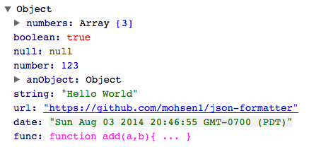

# JSON Formatter
[](https://travis-ci.org/mohsen1/json-formatter)
[](https://codeclimate.com/github/mohsen1/json-formatter)

JSON Formatter is an AngularJS directive for rendering JSON objects in HTML with a **collapsible** navigation.

[](http://azimi.me/json-formatter/demo/demo.html)

#### [Now also available in pure JavaScript with zero dependency!](https://github.com/mohsen1/json-formatter-js)

## Usage

* Install via Bower or npm

  ```bash
  bower install json-formatter --save
  ```
  ...or

  ```bash
  npm install jsonformatter --save
  ```
* Add `jsonFormatter` to your app dependencies

  ```js
  angular.module('MyApp', ['jsonFormatter'])
  ```
* Use `<json-formatter>` directive

  ```html
  <json-formatter json="{my: 'json'}" open="1"></json-formatter>
  ```
* `open` attribute accepts a number which indicates how many levels rendered JSON should be opened

#### Configuration

You can use `JSONFormatterConfig` provider to configure JOSN Formatter.

Available configurations

##### Hover Preview
* `hoverPreviewEnabled`: enable preview on hover
* `hoverPreviewArrayCount`: number of array items to show in preview Any array larger than this number will be shown as `Array[XXX]` where `XXX` is length of the array.
* `hoverPreviewFieldCount`: number of object properties to show for object preview. Any object with more properties that thin number will be truncated.

Example using configuration

```js
app.config(function (JSONFormatterConfigProvider) {

  // Enable the hover preview feature
  JSONFormatterConfigProvider.hoverPreviewEnabled = true;
});
```

## Demo
See [Examples here](http://azimi.me/json-formatter/demo/demo.html)


## Known Bugs
##### `hashKey`

If you are iterating in an array of objects using `ng-repeat`, make sure you are using `track by $index` to avoid adding extra `$$hashKey` to your objects.

## Browser Support
All modern browsers are supported. Lowest supported version of Internet Explorer is **IE9**.

## License

Apache 2.0

See [LICENSE](./LICENSE)
