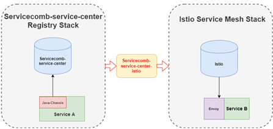

# Servicecomb-service-center-istio
This tool synchronizes microservices from Servicecomb service center registry to Istio system which makes istio based service is able to discover Servicecomb service center based service.

# Architecture & Design
If you are interested in understanding how Servicecomb-service-center-istio works and want to understand the detailed design of Servicecomb-service-center-istio, you can go to see [Servicecomb-service-center-istio Design](docs/design.md)

# Getting Started & Documentation
Documentation is available in [User Guide](docs/user_guide.md)

