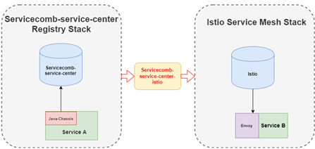

# Servicecomb-service-center-istio
This tool synchronizes microservices from Servicecomb service center registry to Istio system which makes istio based service is able to discover Servicecomb service center based service.

# Getting Started & Documentation
Documentation is available in [User Guide](../docs/user-guides/integration-istio.md)

