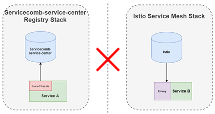
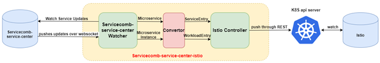
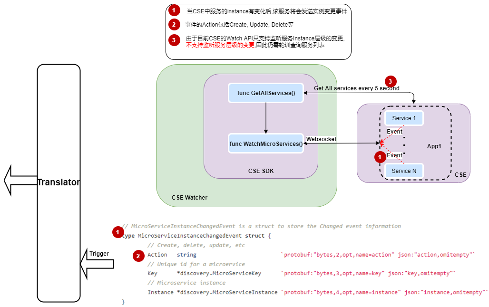
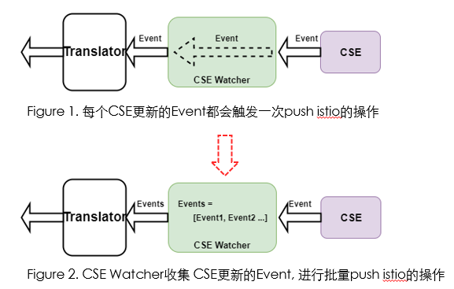
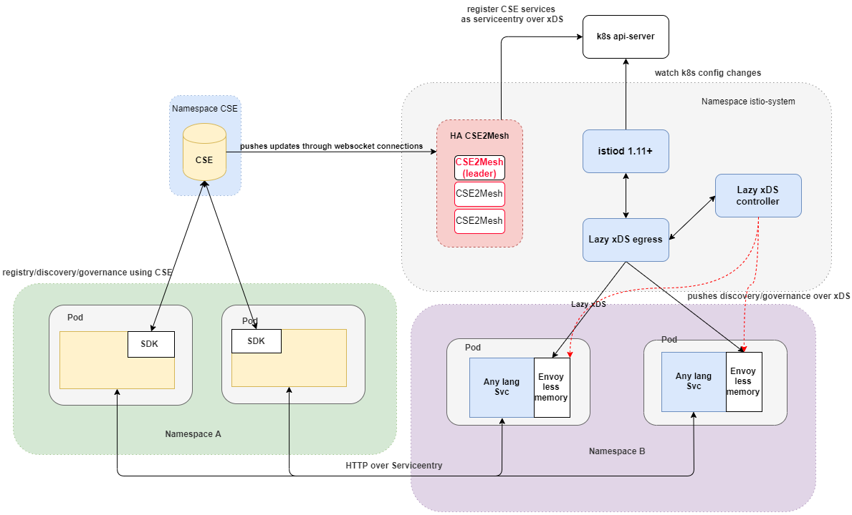

[[_TOC_]]
# Design
## 1. Problem statement and context

In the process of application modernization, it is common for users to use multiple microservice technology stacks (servicecomb-service-center and istio) at the same time. So, they have a high demand to break the communication barrier between two heterogeneous tech stacks which is caused by the different Registration and Discovery mechanisms.

## 2. Our solution

We propose a tool that can synchronizes microservices from servicecomb-service-center to Istio system which makes istio-based services are able to discover servicecomb-service-center-based services

### 2.1 Design

As we can see from this Figure 3, servicecomb-service-center-istio synchronizes service register information from servicecomb-service-center side to istio side. It mainly does three steps:
*	It watches servicecomb-service-center updates (microservice instance status changes event: add, delete, update) via a WebSocket connection.
*	It converts servicecomb-service-center data model (microservice and microservice instance) to Istio data model (ServiceEntry and WorkloadEntry)
*	It pushed converted data model to K8S api server through REST api.

After doing all these steps, Istio automatically captures these converted ServiceEntry and WorkloadEntry and dispatches them to each Envoy sidecar, so that each sidecar can discover those servicecomb-service-center services.

Servicecomb-service-center-istio containes 3 components:
#### 2.1.1 Servicecomb Service Center controller

Service Center controller responses to watch Service Center Microservice Instance update.

Service Center controller leveraging [go-chassis](https://github.com/go-chassis/go-chassis) SDK Watch API to watch Service Center Update.

The controller will create a websocket connection with a Service Center application, and create a watcher for every Microservice, all the update events will be push back from Service Center through the websocket connection.

**Note: Currently, Service Center SDK only provides Microservice instance level watch, so the controller need to fetch all service from Service Center every 5 seconds**

#### 2.1.2 Convertor
Translator is used to convert Service Center language (Microservice and Instance) to istio language (Serviceentry and Workloadentry)

| Istio | Service Center |
| ------ | ------ |
| WorkloadEntry.Address | MicroServiceInstance.Endpoints.IP |
| WorkloadEntry.Labels.name | MicroServiceInstance.HostName |
| WorkloadEntry.Labels.serviceCenterInstanceId | MicroServiceInstance.InstanceId |
| WorkloadEntry.Ports.Number | MicroServiceInstance.Endpoints.Port |
| WorkloadEntry.Ports.TargetNumber | MicroServiceInstance.Endpoints.Port |
| WorkloadEntry.Ports.Protocol | MicroServiceInstance.Endpoints.protocol |
| WorkloadEntry.Ports.Name| MicroServiceInstance.Endpoints.protocol + MicroServiceInstance.Endpoints.Port|
| ServiceEntry.ObjectMeta.Name | MicroService.ServiceName |
| ServiceEntry.Spec.Hosts | MicroService.ServiceName |
| ServiceEntry.Spec.Ports | MicroServiceInstance.Endpoints.port |

#### 2.1.3 Istio controller
Istio controller response to receive update events from Service Center and push to K8S api server.

##### 2.1.3.1 Debouncing
Service Center Controller is Event driven, for every Service Center microservice instance update event will trigger the istio push operation, so when update events are very frequent, there will be frequent istio pushes which gives prassure to Istio side.

In order to solve this we implemented the `debouncing` feature. Which is a kind of buffer, the buffer responsible for collecting events and then pushing them in a unified manner.

debounce rules:
* When Service Center Watcher does not receive a new Event within 1 second after receiving an updated Event from Service Center, perform a push operation
* When Service Center Watcher receives a new Event within 1 second after receiving the updated Event from Service Center, continue to wait for the next 1 second and execute the same logic until a push is made after 10 seconds
* When Service Center Watcher receives a new Event within 1 second after receiving the updated Event from Service Center, continue to wait for the next 1 second and execute the same logic, if the number of Events exceeds 1000 in this push cycle, execute a push

### 2.2 High avalibility

To improve availability, we use the Leader Election function provided by K8S to achieve high availability of Servicecomb-service-center-istio. We also add command line parameters so that users can choose whether to enable high availability or not.

The user can deploy multiple `Servicecomb-service-center-istio` in the cluster, but only one will be choosen as the leader and active working, the others are on hold status, whenever the leader is unavailable, a new leader will be elected ad keep working.

## 3. Limitations
1. When there are large numbers of microservice in Service Center, after sync them to Istio, will cause scalability issue, the envoy sidecar's memory consumption will be very high.

2. Servicecomb-service-center-istio passively receives update events from Service Center services and performs Istio pushing, while if a user manually removes a serviceentry from K8S/Istio that is synced over, Servicecomb-service-center-istio does not sense it, so the serviceentry will not be synced again.