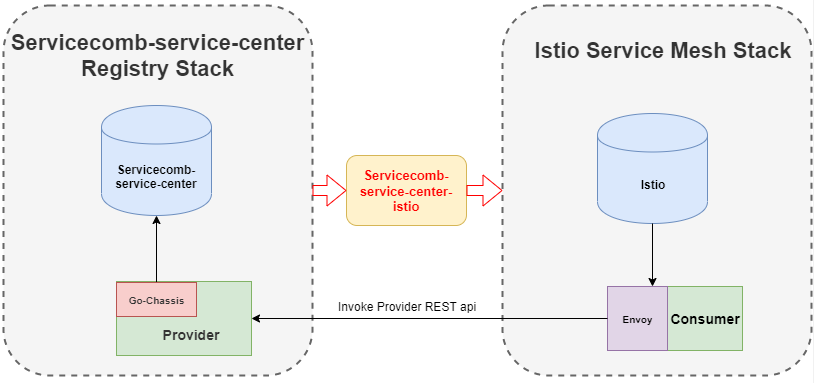

# Context
We have two services: Provider and Consumer:
* `provider` is the provider of a service which calculates and returns the sum of the square root from 1 to a user provided parameter `x`.
* `consumer` performs as both provider and consumer. As a consumer, it calls the api provided by `provider` to get the result of the sum of square roots;
as a `provider`, it provides a service externally which returns the result it gets from `provider` to its clients.

While Provider uses servicecomb service center tech stack, Consumer uses istio tech stack. Origionaly, Provider and Consumer couldn't discover each other. 

In this demo, we are going to adopt our servicecomb-service-center-istio to brake the barrier between Provider and Consumer.

The logical network and calling relationship of the Provider and Consumer is as follows：



# Pre-use preparation
Please follow [user-guide](../../docs/user_guide.md) to install all the required environment as well as the servicecomb-service-center-istio tool.

# Build Provider and Consumer service
## Consumer
```
# go to consumer folder and run
> go build -o consumer main.go
```

## Provider
Make sure you have already configed the registry related configuration (provider/conf/chassis.yaml)
```
# go to provider folder and run
> go build -o provider main.go
```

# Build consumer and provider docker images
## Consumer
```
# go to consumer folder and run
> docker build -t consumer:dev .
```

## Provider
```
# go to provider folder and run
> docker build -t provider:dev .
```

# Deploy consumer and provider services
## Consumer
Because Consumer is Istio-based service, so it has to be run in the Kubernetes. We have our [deploument yaml](manifest/consumer.yaml) file to deploy consumer into Kubernetes
```
> kubectl apply -f manifest/consumer.yaml
```
## Provider
Provider service could be deployed either on a `VM` or `Kubernetes` cluster.

For VM
```
# go to provider folder and run
> ./provider
```

For Kubernetes
```
> kubectl apply -f manifest/provider.yaml
```

# Testing
Now you can try to request `consumer` service and you can get the response which is actually return from `provider` service.
```
> curl http://${consumerip}:${consuemrport}/sqrt?x=1000
Get result from microservice provider: Sum of square root from 1 to 1000 is 21065.833111
```